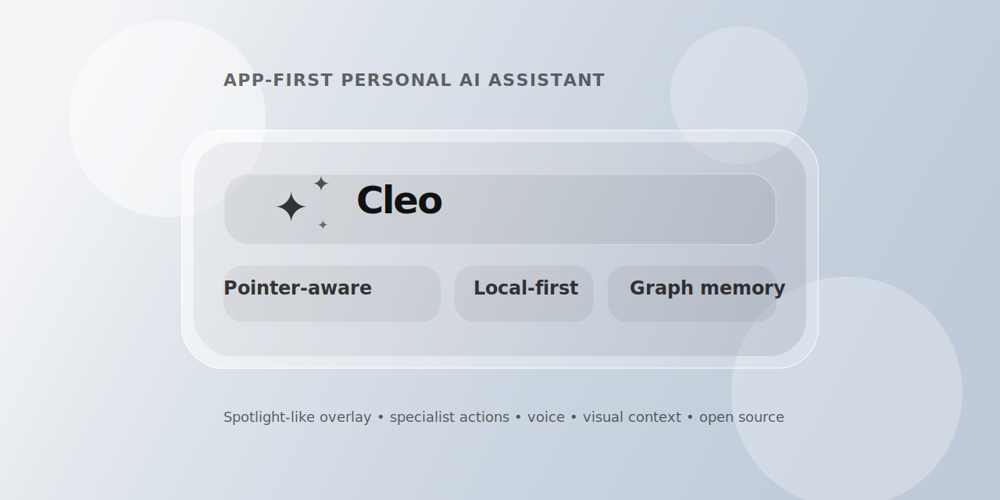
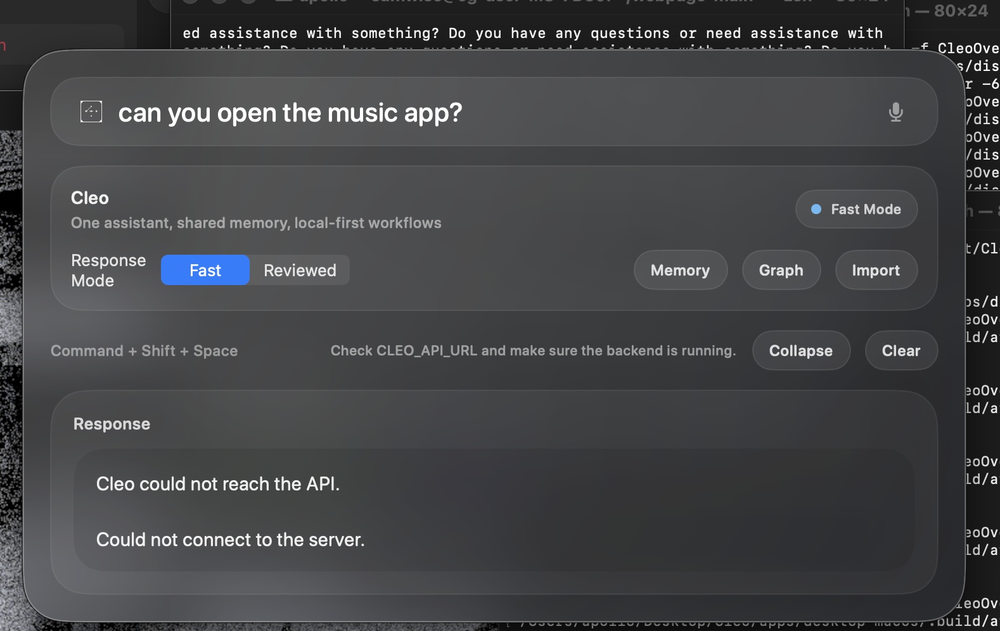

# Cleo




[](LICENSE)

Cleo is a local-first, app-native personal AI assistant designed to feel like part of your operating system rather than another browser tab.

It combines a native macOS overlay, lightweight multimodal context, deterministic action routing, and persistent graph memory into one assistant surface. The goal is simple: fast access, grounded context, and practical automation across the tools you already use.

Cleo is open source under the MIT License.

## GitHub Metadata

**Repository description**

`A local-first, app-native personal AI assistant with a native macOS overlay, multimodal context, graph memory, and specialist action routing.`

**Short tagline**

`One personal assistant, shared memory, native presence.`

**Suggested topics**

`ai-assistant`, `macos`, `swiftui`, `python`, `local-first`, `multimodal`, `agentic-ai`, `graph-memory`, `desktop-ai`, `voice-interface`

## About

Cleo is a local-first assistant for people who want AI to feel embedded in their actual workflow instead of trapped in a chat tab. It combines a native macOS overlay, pointer-aware visual context, lightweight graph memory, and specialist action routing so you can ask questions, trigger actions, remember preferences, and work across tools through one coherent interface.

The long-term direction is clear: one personal assistant, shared memory across surfaces, and an interaction model that feels closer to native system software than to a generic chatbot.

## Why Cleo?

- It behaves like a native system tool, not a web app you visit occasionally.
- It keeps lightweight personal context through graph memory instead of hiding everything inside one oversized prompt.
- It can route practical requests into direct specialist actions instead of forcing every interaction through a single heavyweight response path.
- It is designed to remain useful on modest local hardware.
- It treats UI, pointer context, voice, memory, and automation as parts of one coherent product.

## At a Glance

| Capability | Cleo |
| --- | --- |
| Primary surface | Native macOS overlay |
| Interaction style | Ask, command, point, speak |
| Context model | Pointer-aware + visual + memory graph |
| Memory | Persistent lightweight graph memory |
| Action path | Deterministic specialist tools |
| Local support | Yes |
| Model strategy | Small local multimodal default |
| Access points | Desktop, CLI, API, mobile scaffold |
| License | MIT |

## What Cleo Already Does

- Spotlight-style macOS overlay with glass UI
- Menu bar app with global hotkey
- Pointer-pinned mini prompt for fast contextual input
- Pointer-aware screen capture and OCR-assisted visual context
- Local-first chat and command routing
- Lightweight specialist workflow for command execution
- Graph-based persistent memory in `.cleo/state.json`
- ChatGPT export import pipeline
- CLI, API, desktop, and mobile app surfaces sharing the same core
- Voice input support and optional wake-word path

## Product Shape

Cleo is organized around one shared assistant core and multiple thin clients:

```text
                   +--------------------+
                   |   assistant-core   |
                   | memory • routing   |
                   | tools • graph      |
                   +---------+----------+
                             |
          +------------------+------------------+
          |                  |                  |
      FastAPI API            CLI            macOS overlay
          |                                     |
          |                                 pointer context
          |                                 voice input
          |                                 menu bar app
          |
       mobile app
```

## Preview



Today, Cleo is centered around a native macOS overlay with:

- a Spotlight-like summon flow
- a pointer-pinned mini prompt
- lightweight visual context capture
- a menu bar presence
- local-first command routing

The current repo includes the desktop app assets, app icon, and the working overlay implementation in `apps/desktop-macos`.

## Current Model Strategy

The default local model path is:

- `HuggingFaceTB/SmolVLM-500M-Instruct`

Why this model:

- lightweight enough for local experimentation on Apple Silicon
- can handle plain text chat
- can also work with screenshot-style visual context
- better aligned with Cleo’s local-first and app-aware direction than a heavier hosted-only setup

Online routing is still supported, but optional.

## Repo Layout

- `apps/api`
  FastAPI backend exposing chat, command, graph, memory, and import endpoints.

- `apps/cli`
  Terminal client for chatting with Cleo, running commands, and inspecting memory/model state.

- `apps/desktop-macos`
  Native macOS app with Spotlight-like overlay, menu bar presence, voice input, pointer awareness, and a local bridge to the Python backend.

- `apps/mobile`
  Mobile client scaffold.

- `packages/assistant-core`
  Shared orchestration, memory, context building, graph storage, tool registry, LLM routing, and command-specialist workflow.

- `docs`
  Architecture notes and longer-form project thinking.

## Argus Episodic Memory Add-On

Cleo can connect to [Argus](https://github.com/omkhairate/argus) as a local episodic-memory service for wearable camera recall, day summaries, and graph sync.

Run Cleo's API on its default port and Argus on `8010`:

```bash
uvicorn cleo_api.main:app --reload --port 8000
uvicorn argus.api:app --reload --port 8010
```

Relevant Cleo environment variables:

```env
CLEO_ARGUS_ENABLED=true
CLEO_ARGUS_BASE_URL=http://127.0.0.1:8010
CLEO_ARGUS_TIMEOUT_SECONDS=60
```

CLI commands:

```bash
cleo argus-query "where did I leave my charger?"
cleo argus-sync-graph
```

Cleo also uses Argus automatically for time-bound autobiographical questions such as “what did I do after lunch?” or “where did I leave my keys?” when Argus is available.

## Core Concepts

### 1. Auto mode, not manual mode switching

Cleo decides whether something is:

- chat
- command
- memory update
- action request
- workspace inspection

The goal is to feel like one assistant, not a bag of separate toggles.

### 2. Specialist actions

For command-like requests, Cleo can break work into smaller specialist tasks. Current roles include:

- `action`
- `memory`
- `workspace`
- `connector`
- `planner`
- `writer`

That lets Cleo stay lightweight while still behaving more agentically than a single flat prompt.

### 3. Graph memory

Cleo stores durable memory in a lightweight graph so it can remember:

- user preferences
- workflows
- tasks
- connected tools
- relationships between concepts and apps

This is also the basis for the future visual “brain” view.

### 4. App-first context

The macOS app is not just a chat window. It is meant to work with:

- what your pointer is near
- what text is selected
- what region of the screen you captured
- what app or window you are interacting with

## Local Development

### Python setup

```bash
cd /Users/apollo/Desktop/Cleo
python3 -m venv .venv
source .venv/bin/activate
pip install -e .
pip install torch transformers pillow torchvision
```

### Environment

Copy the example file and adjust as needed:

```bash
cp .env.example .env
```

Default local-first settings:

```env
CLEO_ROUTING_MODE=local-only
CLEO_LOCAL_MODEL_PROVIDER=transformers-smolvlm
CLEO_LOCAL_MODEL_ID=HuggingFaceTB/SmolVLM-500M-Instruct
CLEO_STATE_FILE_PATH=.cleo/state.json
```

### Run the API

```bash
source .venv/bin/activate
PYTHONPATH=/Users/apollo/Desktop/Cleo uvicorn cleo_api.main:app --host 127.0.0.1 --port 8000
```

### CLI usage

```bash
source .venv/bin/activate
cleo chat "What can you do?"
cleo command "Open Music and then remember that I prefer app-first design"
cleo model-status
cleo profile
cleo history
cleo brain-graph
```

## macOS App

Build and run:

```bash
cd /Users/apollo/Desktop/Cleo/apps/desktop-macos
./scripts/build_app.sh
open dist/Cleo.app
```

Main interaction patterns:

- `Command + Shift + Space` opens the centered overlay
- double right-click opens the pointer-pinned mini prompt
- the mic button starts voice capture
- the menu bar item gives quick access to Cleo controls

Wake word:

- wake word is opt-in
- macOS may require its own speech package and permissions before background listening works
- Cleo includes shortcuts to open speech settings directly

## Action Layer

Direct actions are a key part of Cleo’s UX. The current deterministic tool layer includes things like:

- opening macOS applications
- controlling YouTube playback
- controlling browser video playback
- controlling Music or Spotify playback
- drafting emails in Mail
- delegating tasks to Codex through Terminal

The goal is that obvious actions complete immediately instead of waiting on an unnecessarily heavy model response.

## Visual Context

The macOS app can attach lightweight visual context to a request, including:

- selected text
- OCR text
- screenshot region summaries
- pointer-based capture context

This makes prompts like “what does this mean?” much more grounded than plain chat alone.

## Persistence

Cleo persists its lightweight local state in:

- `.cleo/state.json`

That state currently covers:

- profile memory
- graph memory
- conversation history
- import history

## Importing ChatGPT History

Cleo can import ChatGPT export history through the UI and persist it into local memory/graph state. This is meant to help bootstrap personalization without forcing you to start from zero.

## Notable Design Goals

- app-first instead of browser-first
- local-first instead of cloud-required
- ambient instead of modal
- graph memory instead of giant hidden prompt state
- specialist workflows instead of one heavyweight model doing everything
- one shared assistant brain across all surfaces

## Status

Cleo is a working prototype with real local functionality, not just a concept mockup. The desktop app, local memory, pointer-aware context, and specialist command workflow are all active parts of the project.

It is still evolving, especially around:

- richer action execution
- more reliable multimodal grounding
- improved graph visualization
- broader app integrations
- smoother wake-word setup

## Roadmap Direction

Near-term improvements that fit the current architecture well:

- stronger app/action registry
- better graph visualization UI
- richer email, browser, and system automation
- more robust multimodal local inference
- improved mobile parity
- cleaner onboarding for voice, permissions, and model setup

## License

Cleo is released under the [MIT License](LICENSE).
